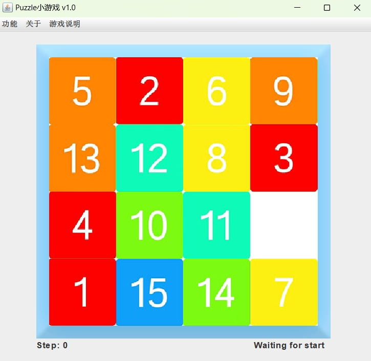
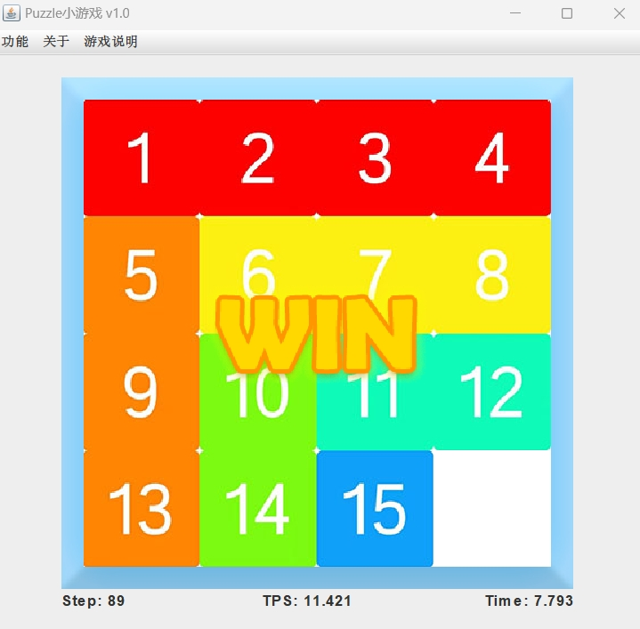

# 15puzzle

## 简介

使用swing编写的图形化界面，新手时期作品

本项目是刚学习Java的时候跟着黑马程序员的阿玮老师做的，在原本拼图游戏的基础上加入了滑动操作以及tps、步数、时间显示等内容

## 运行方法

使用IDEA打开，找到App.java，运行即可，操作方法在软件的菜单栏中

## 运行效果

打乱：

还原：

## 关于打乱

打乱并不是直接随机打乱长度为16的数组，而是需要验证打乱是否有解：

数字华容道NxN数字随机排列的阵列有解的充要条件是：
**（总逆序数 + 0的行号 + 0的列号）与 N 不同奇偶（行号列号从0开始）**

由于本项目只制作了15p，并未制作更高阶，所以在求逆序数时采用暴力算法，推荐使用归并排序的方法来计算
